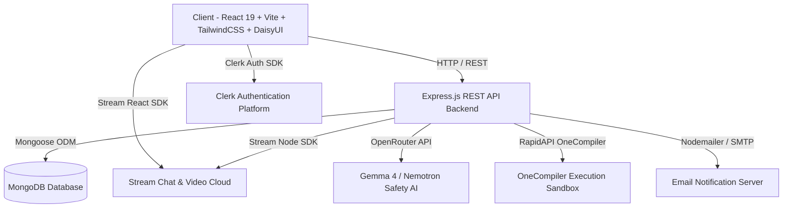

<div align="center">

  <h1>Anva</h1>
  <p><strong>The Global Learning, Peer Networking, Placement Prep &amp; AI Intelligence Hub</strong></p>

  <p>
    <a href="https://anva-akzm.onrender.com/" target="_blank">
      
    </a>
  </p>

  <p>
    
    
    
    
    
    
    
    
    
    
    
  </p>

</div>

---

## 📖 Overview

**Anva** is an all-in-one educational social network, technical interview & placement accelerator, real-time collaboration workspace, and AI-powered learning hub. Built for modern learners, developers, and job seekers worldwide, Anva combines video/voice calling, real-time messaging, multi-language code compilation, AI study assistants, interactive flashcard studios, community feeds, and company-specific recruitment preparation into a cohesive, responsive web platform.

---

## 🌟 Comprehensive Feature Tour

### 🎯 1. Placement Hub & Technical Interview Prep
An extensive, company-mapped preparation suite tailored for on-campus and off-campus recruitment:
- **12+ Top Tier Multinationals & FAANG Profiles**: Dedicated recruitment roadmaps, round-by-round breakdown (Online Assessment, Technical Rounds, System Design, HR / Behavioral), package benchmarks (LPA), and hiring tracks for **Google, Microsoft, Amazon, Meta, Adobe, TCS (Ninja/Digital/Prime), Infosys (SE/DSE/SP), Wipro (Elite/Turbo), Accenture (ASE/AASE), Deloitte, Cognizant (GenC/GenC Elevate/GenC Next), and Capgemini**.
- **4 Dedicated Practice Tracks**:
  - **Quantitative & Logical Aptitude**: Time, speed & distance, profit/loss, percentages, series, probability, with interactive step-by-step explanations and formulas.
  - **English & Verbal Communication**: Reading comprehension, error spotting, sentence completion, vocabulary, and grammar rules.
  - **Core CS & Technical Fundamentals**: DBMS, Operating Systems, Object-Oriented Programming (OOP), Computer Networks, System Design, and Data Structures theory.
  - **Algorithmic Coding Sandbox**: In-browser Monaco code editor with starter boilerplate in **JavaScript, Python, C++, and Java**, hidden test cases validation, time/space complexity guidelines, and instant test runner.
- **Company-Specific Timed Mock Assessments**: Multi-section online exams simulating real company tests with section timers, question navigation palettes, automated scoring, answer review keys, and detailed performance scorecards.
- **Progress Tracking & Bookmarks**: Real-time company readiness percentage calculations, saved bookmarks, accuracy metrics, and progress reset controls.

---

### 📹 2. Real-Time Video Calling & Audio Chat
Seamless, zero-latency WebRTC communications powered by the **Stream Video SDK**:
- **WhatsApp-Style Calling Window**: Calls launch in an optimized, distraction-free popup window with automatic audio-device negotiation.
- **Synthesized Ringing Engine**: Web Audio API-powered dynamic oscillator tones for incoming ringing, outgoing calling chimes, accept pings, and end beeps without heavy static assets.
- **Cross-Tab & Multi-Window Signaling**: Native HTML5 `BroadcastChannel` synchronization ensures real-time call status updates across tabs and windows.
- **Global Incoming Call Modal**: Instant audio-visual prompt across any page with Accept, Decline, and caller preview.
- **Rich Call Features**: HD video streaming, microphone toggle, camera switcher, screen sharing, speaker layout, and participant grids.
- **Call History Attachments**: Visual call summaries posted directly in Stream Chat channels with call duration, status (completed, missed, declined), timestamps, and one-click redial.

---

### 💬 3. Real-Time Chat & Direct Messaging
Powered by the **Stream Chat SDK**:
- **1-on-1 & Group Conversations**: Instant messaging with friends and study partners.
- **Rich Chat Capabilities**: Typing indicators, emoji reactions, message threads, file attachments, and online presence indicators.
- **Global Notification Badges**: Unread message indicators and real-time toast alerts on new incoming messages while navigating anywhere across the platform.

---

### 🧠 4. AI Study Assistant & Doubt Solver
An intelligent AI companion powered by **OpenRouter AI** (`openrouter/free` with automatic fallback to `google/gemma-4-31b-it:free`):
- **Interactive Doubt Resolution**: Ask academic questions, conceptual explanations, algorithm optimizations, and debugging queries.
- **Persistent Chat History**: Previous conversation sessions saved to MongoDB with multi-session history switching and one-click session clearing.
- **Voice-to-Text & Text-to-Speech**: Hands-free voice input via Web Speech Recognition API and audible response reading using SpeechSynthesis.
- **Visual Image Problem Solving**: Attach code screenshots or textbook diagrams directly to AI prompts.
- **Instant Grammar Checker**: Dedicated language syntax and grammar analyzer with diff corrections and one-click copy.
- **Quick Topic Prompts**: Pre-configured prompts for React Lifecycle, Python Comprehensions, SQL Joins, Binary Search Tree traversals, and more.

---

### 💻 5. Multi-Language Online Code Compiler
Integrated code execution engine powered by **OneCompiler API via RapidAPI**:
- **20+ Supported Languages**: JavaScript, Python, TypeScript, Java, C, C++, C#, Go, Rust, Ruby, PHP, Swift, Kotlin, Dart, SQL, MySQL, PostgreSQL, MongoDB, HTML, CSS, and Bash.
- **Standard Input (`stdin`) Support**: Pass custom input test cases directly to program standard input.
- **Execution Benchmarks**: Real-time measurement of code execution time (ms), limit exceedance detection, and formatted stdout/stderr stream outputs.
- **Monaco Code Editor**: VS Code-grade editor with syntax highlighting, line numbering, auto-closing brackets, and theme syncing.

---

### 📰 6. EduFeed & Community Knowledge Sharing
A collaborative social feed tailored for learners:
- **Rich Multimedia Posts**: Share study updates, problem solutions, code snippets, compressed images, and **PDF study guides** with inline viewers.
- **Subject Categorization**: Filter community feed by *Computer Science, Mathematics, Languages, Science, Study Tips, or General*.
- **Interactive Engagements**: Like animations, threaded discussions, comment editing/deletion, and bookmarking to a dedicated **Saved Posts** library (`/saved-posts`).
- **Dual-Layer Content Safety & Moderation**:
  - Sub-millisecond regex pattern matching for instant profanity and hate speech filtering.
  - Advanced AI content moderation via **NVIDIA Nemotron 3.5 Content Safety AI** on OpenRouter.

---

### 👥 7. Peer Networking & Language Exchange
Find and connect with fellow students and study buddies across the globe:
- **Smart Recommendations**: Filter peers by native language, target learning language, location, and CEFR proficiency level (*A1 Beginner* to *C2 Native/Master*).
- **Friend Request Lifecycle**: Send friend requests, view incoming/outgoing requests, cancel pending invitations, accept connections, and unfriend.
- **Study Streaks & Heartbeat Presence**: Active streak flame counters, keep-alive heartbeat ping (`/api/auth/ping`), and real-time online status indicators.
- **User Profiles**: Custom banner art, avatars, bios, GitHub & LinkedIn links, study statistics, and recent activity.
- **Safety & Blocking**: Block abusive users with dedicated management via `/blocked-users`.

---

### 🎴 8. Flashcards Studio & Study Guides
Curated repository of interactive flashcard decks with official PDF study materials:
- **28+ Curated Decks**: C, C++, Java, Python, JavaScript, React, Node.js, Express, MongoDB, MySQL, PostgreSQL, HTML, CSS, TailwindCSS, Bootstrap, Git, GitHub, Linux, Docker, Kubernetes, TypeScript, Go, Rust, PHP, Ruby, Swift, Kotlin, Flutter, Django, C#, SQL, Bash, Dart, R, Scala, Haskell, Next.js, Vue.js, and Angular.
- **Flip Cards & Direct PDF Viewers**: Test knowledge with 3D flip card animations and access comprehensive documentation guides instantly.

---

### ⏱️ 9. Pomodoro Focus Studio
A built-in productivity tool to maximize study efficiency:
- **3 Configured Modes**: Focus Session (25 min), Short Break (5 min), Long Break (15 min) + custom minute duration inputs.
- **Web Audio Chimes**: Gentle audio completion chimes synthesized via HTML5 AudioContext.
- **Floating & Minimized Views**: Minimize to a compact floating timer while browsing other pages without interrupting sessions.

---

### 🛡️ 10. Role-Based Admin Panel (`/admin`)
An enterprise-grade administrative cockpit for platform governance:
- **Admin Stats Overview**: Live counts of total registered users, active users, total posts, pending complaints, and suspended accounts.
- **Global Broadcast Announcements**: Publish platform-wide alerts pushed instantly to all users.
- **User Management**: Search, edit user details, promote/demote roles (`user` ↔ `admin`), suspend/unsuspend accounts with custom reasons, and permanently delete accounts.
- **Support Grievance & Ticket Resolution**: Triage user reports by category (*Bug, Abuse/Harassment, Account Appeal, Feature Request, Spam*), update ticket statuses, issue warning notifications, and suspend offenders directly from tickets.
- **Feed Moderation**: Review flagged community posts and delete inappropriate submissions.

---

### 🎫 11. Support & Grievance Ticketing (`/support`)
Structured issue reporting and resolution system:
- **Categorized Ticket Submission**: File detailed tickets with device metadata, affected features, reported user handles, and abuse descriptions.
- **Status & History Tracking**: View ticket progress in real-time (*Pending, In Progress, Resolved, Rejected*) along with admin resolution notes.
- **Email Notifications**: Automated resolution updates sent via **Nodemailer**.

---

### 🎨 12. 32 Dynamic DaisyUI Themes & Apple-Minimal Aesthetics
- **Theme Switcher**: Instant switching between 32 themes (*Dark, Light, Cupcake, Cyberpunk, Luxury, Dracula, Synthwave, Nord, Sunset, Aqua, Retro, Forest, etc.*) stored in persistent Zustand local state.
- **WhatsApp Wallpaper Background**: Ambient wallpaper pattern across all pages.
- **Framer Motion Animations**: Smooth page transitions, spring physics, and micro-interactions.

---

## 🛠️ Architecture & Tech Stack



### **Frontend**
- **Framework**: React 19 (Vite 6)
- **Styling & Theming**: TailwindCSS 3, DaisyUI 4 (32 themes), Custom Glassmorphism CSS
- **Routing**: React Router 7 (`react-router` & `react-router-dom`)
- **State Management & Data Fetching**: TanStack React Query v5 + Zustand
- **Authentication**: `@clerk/clerk-react` + Axios Clerk Interceptor
- **Real-Time Video & Chat**: Stream Video React SDK (`@stream-io/video-react-sdk`) + Stream Chat React (`stream-chat-react`)
- **Code Editor**: `@monaco-editor/react` (Monaco Editor)
- **Icons & Motion**: Lucide React + React Icons + Framer Motion
- **Image Compression**: `browser-image-compression`
- **Notifications**: `react-hot-toast`

### **Backend**
- **Runtime**: Node.js (ES Modules)
- **Web Framework**: Express 4
- **Database**: MongoDB via Mongoose 8 ODM with performance indexing
- **Authentication & Security**: Clerk Backend SDK (`@clerk/express`), JSON Web Tokens (`jsonwebtoken`), `bcryptjs`, `cookie-parser`, `cors`, `express-rate-limit`
- **Real-Time Integration**: `stream-chat` Node SDK
- **AI & Moderation**: OpenRouter API (`google/gemma-4-31b-it:free`, `openrouter/free`, `nvidia/nemotron-3.5-content-safety:free`)
- **Compiler Integration**: RapidAPI OneCompiler execution gateway
- **Email Delivery**: Nodemailer 8 (SMTP)
- **Webhooks**: Svix 1 (`svix` Clerk webhook verification)

---

## 📁 Directory Structure

```
Anva/
├── backend/
│   ├── src/
│   │   ├── controllers/
│   │   │   ├── admin.controller.js        # Admin analytics, user ops, complaints & post moderation
│   │   │   ├── assistant.controller.js    # AI Assistant doubt chat & grammar check
│   │   │   ├── auth.controller.js         # Signup, login, onboarding, ping, password reset
│   │   │   ├── chat.controller.js         # Stream Chat token generation
│   │   │   ├── clerk.controller.js        # Clerk webhook user sync (Svix verified)
│   │   │   ├── notification.controller.js # Notifications fetch & mark-read
│   │   │   ├── placement.controller.js    # Company data, questions, coding tests, mock tests
│   │   │   ├── post.controller.js         # EduFeed posts, comments, likes, saves & moderation
│   │   │   ├── support.controller.js      # Support tickets & grievance filing
│   │   │   └── user.controller.js         # Profiles, friend requests, recommendations, blocking
│   │   ├── lib/
│   │   │   ├── contentSafety.js           # Regex + NVIDIA Nemotron 3.5 AI moderation
│   │   │   ├── db.js                      # MongoDB connection helper
│   │   │   ├── nodemailer.js              # SMTP email dispatch for support & password reset
│   │   │   ├── placementCodingQuestionsData.js # Comprehensive DSA coding question bank
│   │   │   ├── placementQuestionsData.js  # Aptitude, English & Technical question bank
│   │   │   ├── seedAdmin.js               # Default admin seeding utility
│   │   │   ├── seedPlacementData.js       # Auto-seed companies & question database
│   │   │   └── stream.js                  # Stream Chat & Video Node client
│   │   ├── middleware/
│   │   │   ├── admin.middleware.js        # Admin authorization guard
│   │   │   ├── auth.middleware.js         # Clerk JWT + custom JWT token protection
│   │   │   └── rateLimiter.js             # Global & Auth rate limiters
│   │   ├── models/
│   │   │   ├── ChatMessage.js             # AI Assistant doubt messages
│   │   │   ├── FriendRequest.js           # Peer connection requests
│   │   │   ├── Notification.js            # In-app notifications & admin alerts
│   │   │   ├── PlacementCompany.js        # Company profiles, rounds & hiring tracks
│   │   │   ├── PlacementProgress.js       # User solved questions, bookmarks & mock history
│   │   │   ├── PlacementQuestion.js       # MCQs and coding problem definitions
│   │   │   ├── Post.js                    # EduFeed posts, comments, likes, attachments
│   │   │   ├── SupportTicket.js           # Support tickets & grievance records
│   │   │   └── User.js                    # User accounts, streaks, languages, roles, blocks
│   │   ├── routes/
│   │   │   ├── admin.route.js             # /api/admin
│   │   │   ├── assistant.route.js         # /api/assistant
│   │   │   ├── auth.route.js              # /api/auth
│   │   │   ├── chat.route.js              # /api/chat
│   │   │   ├── clerk.route.js             # /api/webhooks/clerk
│   │   │   ├── compiler.route.js          # /api/compiler
│   │   │   ├── notification.route.js      # /api/notifications
│   │   │   ├── placement.route.js         # /api/placement
│   │   │   ├── post.route.js              # /api/posts
│   │   │   ├── support.route.js           # /api/support
│   │   │   └── user.route.js              # /api/users
│   │   ├── scripts/
│   │   │   ├── enrichCodingTestCases.js   # Automated test-case enricher
│   │   │   └── generateAllHardTestCases.js# Hard algorithmic test case generator
│   │   └── server.js                      # Express server entry point & static serving
│   ├── package.json
│   └── .env
│
├── frontend/
│   ├── public/                            # Static assets, logos & favicons
│   ├── src/
│   │   ├── components/
│   │   │   ├── AdminRoute.jsx             # Admin route guard
│   │   │   ├── AnvaBrandLogo.jsx          # Styled SVG logo
│   │   │   ├── AuthCardWrapper.jsx        # Apple-minimal auth shell
│   │   │   ├── AxiosClerkInterceptor.jsx  # Syncs Clerk auth token with Axios headers
│   │   │   ├── CallHistoryAttachment.jsx  # Inline Stream Chat call cards
│   │   │   ├── CommunityFeedSection.jsx   # EduFeed list, comments, lightbox & actions
│   │   │   ├── CompanyLogo.jsx            # Company SVG brand badges
│   │   │   ├── FriendCard.jsx             # Peer card with language & action buttons
│   │   │   ├── IncomingCallModal.jsx      # WhatsApp-style incoming call dialog
│   │   │   ├── Layout.jsx                 # Main layout wrapper with sidebar & navbar
│   │   │   ├── Navbar.jsx                 # Top bar with streak, theme selector & notifications
│   │   │   ├── PomodoroTimer.jsx          # Floating focus timer with Web Audio chimes
│   │   │   ├── ProgressDashboard.jsx      # User profile streak & learning progress stats
│   │   │   ├── ProtectedRoute.jsx         # Auth verification route guard
│   │   │   ├── SharePostModal.jsx         # New post modal with image/PDF upload & AI safety
│   │   │   └── ThemeSelector.jsx          # DaisyUI 32-theme selector
│   │   ├── constants/
│   │   │   └── index.js                   # Themes, languages, flags & CEFR definitions
│   │   ├── context/
│   │   │   └── CallContext.jsx            # Global video/audio call signaling provider
│   │   ├── data/
│   │   │   └── flashcardsData.js          # 28+ programming & tech flashcard decks
│   │   ├── hooks/
│   │   │   ├── useAuthUser.js             # Current authenticated user query
│   │   │   ├── useLogin.js                # Legacy login mutation
│   │   │   ├── useLogout.js               # Logout mutation (Clerk + JWT)
│   │   │   └── useSignUp.js               # Legacy signup mutation
│   │   ├── lib/
│   │   │   ├── api.js                     # Core Axios API methods
│   │   │   ├── axios.js                   # Axios client instance configuration
│   │   │   ├── callSounds.js              # Synthesized Web Audio API call ringtones
│   │   │   ├── callWindow.js              # Popup window manager for calls
│   │   │   ├── clerkAppearance.js         # Clerk custom theme styling
│   │   │   ├── contentModerator.js        # Client-side fast profanity validator
│   │   │   ├── languageQuotes.js          # Curated quotes for language learners
│   │   │   ├── placementApi.js            # Placement Hub API methods
│   │   │   └── quotes.js                  # Daily motivational quotes
│   │   ├── pages/
│   │   │   ├── AdminPage.jsx              # Admin control panel (users, posts, complaints)
│   │   │   ├── AssistantPage.jsx          # AI Assistant doubt chat, voice & grammar
│   │   │   ├── BlockedUsersPage.jsx       # Blocked users manager
│   │   │   ├── CallPage.jsx               # Stream Video calling interface
│   │   │   ├── ChatPage.jsx               # Stream Chat messaging interface
│   │   │   ├── CompilerPage.jsx           # Monaco multi-language online compiler
│   │   │   ├── EduFeedPage.jsx            # Dedicated Community Feed page
│   │   │   ├── FeaturesPage.jsx           # Public feature showcase
│   │   │   ├── FlashcardsPage.jsx         # Interactive flashcards studio
│   │   │   ├── ForgotPasswordPage.jsx     # Password recovery request
│   │   │   ├── FriendProfilePage.jsx      # Public peer profile viewer
│   │   │   ├── Friends.jsx                # Peer discovery & friend requests
│   │   │   ├── HomePage.jsx               # Main user dashboard & daily quote
│   │   │   ├── LandingPage.jsx            # Public landing page with hero & CTAs
│   │   │   ├── LoginPage.jsx              # Legacy login page
│   │   │   ├── NotificationsPage.jsx      # Notifications & admin warnings
│   │   │   ├── OnboardingPage.jsx         # Profile setup (languages, CEFR level, bio)
│   │   │   ├── PrivacyPage.jsx            # Privacy policy
│   │   │   ├── ProfilePage.jsx            # Account settings & profile editor
│   │   │   ├── ResetPasswordPage.jsx      # Password reset token validation
│   │   │   ├── SavedPostsPage.jsx         # Bookmarked community posts
│   │   │   ├── SignUpPage.jsx             # Legacy sign up page
│   │   │   ├── SupportPage.jsx            # Support ticket & grievance submission
│   │   │   ├── TermsPage.jsx              # Terms of service
│   │   │   └── placement/
│   │   │       ├── AptitudePracticePage.jsx   # Quantitative & logical practice
│   │   │       ├── CodingListPage.jsx         # Company coding problems list
│   │   │       ├── CodingProblemPage.jsx      # Monaco coding problem solver
│   │   │       ├── CompanyDashboardPage.jsx   # Company hiring tracks & readiness
│   │   │       ├── EnglishPracticePage.jsx    # Verbal ability & reading practice
│   │   │       ├── InterviewPrepPage.jsx      # Company interview questions & HR tips
│   │   │       ├── MockTestPage.jsx           # Full timed mock assessment
│   │   │       ├── PlacementLandingPage.jsx   # Placement hub company directory
│   │   │       └── TechnicalPracticePage.jsx  # Core CS fundamental MCQs
│   │   ├── store/
│   │   │   └── useThemeStore.js           # Zustand theme state with localStorage sync
│   │   ├── App.jsx                        # Root router, guards & global providers
│   │   ├── main.jsx                       # Application bootstrap
│   │   └── index.css                      # Global styles, DaisyUI & animations
│   ├── package.json
│   ├── tailwind.config.js
│   ├── vite.config.js
│   └── .env
│
├── package.json                           # Root monorepo scripts
├── .gitignore
└── README.md
```

---

## 📡 API Reference Overview

### **Authentication (`/api/auth`)**
| Method | Endpoint | Description | Auth Required |
|---|---|---|---|
| `POST` | `/api/auth/signup` | Register a new local account | No |
| `POST` | `/api/auth/login` | Login with email and password | No |
| `POST` | `/api/auth/logout` | Clear session cookies & logout | Yes |
| `POST` | `/api/auth/forgot-password` | Request password reset email | No |
| `POST` | `/api/auth/reset-password/:token` | Set new password via token | No |
| `POST` | `/api/auth/onboarding` | Complete user onboarding profile | Yes |
| `POST` | `/api/auth/ping` | Heartbeat keep-alive update | Yes |
| `GET` | `/api/auth/me` | Fetch authenticated user object | Yes |

### **Users & Friends (`/api/users`)**
| Method | Endpoint | Description | Auth Required |
|---|---|---|---|
| `GET` | `/api/users` | Get recommended learning partners | Yes |
| `GET` | `/api/users/friends` | Get accepted friends list | Yes |
| `GET` | `/api/users/friend-requests` | Get incoming friend requests | Yes |
| `GET` | `/api/users/outgoing-friend-requests` | Get outgoing friend requests | Yes |
| `POST` | `/api/users/friend-request/:id` | Send a friend request | Yes |
| `DELETE`| `/api/users/friend-request/:id/cancel`| Cancel an outgoing friend request | Yes |
| `PUT` | `/api/users/friend-request/:id/accept`| Accept a friend request | Yes |
| `DELETE`| `/api/users/friend/:id` | Remove a user from friends | Yes |
| `GET` | `/api/users/:id` | Get public profile of a user | Yes |
| `PUT` | `/api/users/profile` | Update profile details (bio, languages, social links) | Yes |
| `PUT` | `/api/users/password` | Update account password | Yes |
| `GET` | `/api/users/blocked` | Get list of blocked users | Yes |
| `POST` | `/api/users/block/:id` | Block a user | Yes |
| `DELETE`| `/api/users/block/:id` | Unblock a user | Yes |

### **Placement Hub (`/api/placement`)**
| Method | Endpoint | Description | Auth Required |
|---|---|---|---|
| `GET` | `/api/placement/companies` | List all companies with user readiness % | Yes |
| `GET` | `/api/placement/companies/:slug` | Company details, rounds, and question metrics | Yes |
| `GET` | `/api/placement/questions` | Filter questions by company, category & topic | Yes |
| `GET` | `/api/placement/questions/:id` | Get question by ID with test cases | Yes |
| `POST` | `/api/placement/submit-answer` | Submit MCQ answer & record score | Yes |
| `POST` | `/api/placement/run-code` | Test code execution against sample test cases | Yes |
| `POST` | `/api/placement/submit-code` | Submit coding solution against all test cases | Yes |
| `POST` | `/api/placement/bookmark` | Toggle question bookmark | Yes |
| `GET` | `/api/placement/bookmarks` | Get all bookmarked questions | Yes |
| `GET` | `/api/placement/progress` | Get detailed analytics & category progress | Yes |
| `POST` | `/api/placement/reset-progress` | Reset solved questions & company stats | Yes |
| `POST` | `/api/placement/mock-test/start` | Generate randomized timed mock assessment | Yes |
| `POST` | `/api/placement/mock-test/submit`| Submit mock test & calculate final scorecard | Yes |

### **Community Posts & EduFeed (`/api/posts`)**
| Method | Endpoint | Description | Auth Required |
|---|---|---|---|
| `GET` | `/api/posts` | Get posts feed with optional subject filter | Yes |
| `POST` | `/api/posts` | Create new post (with text, image, or PDF) | Yes |
| `GET` | `/api/posts/saved` | Get user's saved / bookmarked posts | Yes |
| `GET` | `/api/posts/:id` | Get single post details | Yes |
| `PUT` | `/api/posts/:id` | Update post caption | Yes |
| `DELETE`| `/api/posts/:id` | Delete own post | Yes |
| `POST` | `/api/posts/:id/like` | Toggle post like | Yes |
| `POST` | `/api/posts/:id/save` | Toggle save / bookmark post | Yes |
| `POST` | `/api/posts/:id/comment` | Add comment to post | Yes |
| `PUT` | `/api/posts/:id/comment/:commentId` | Edit comment | Yes |
| `DELETE`| `/api/posts/:id/comment/:commentId` | Delete comment | Yes |

### **AI Assistant & Compiler (`/api/assistant`, `/api/compiler`)**
| Method | Endpoint | Description | Auth Required |
|---|---|---|---|
| `POST` | `/api/assistant/chat` | Send message/image to AI Assistant | Yes |
| `GET` | `/api/assistant/history` | Retrieve previous doubt conversation history | Yes |
| `DELETE`| `/api/assistant/history` | Clear AI doubt conversation history | Yes |
| `POST` | `/api/assistant/grammar` | AI syntax & grammar analysis | Yes |
| `POST` | `/api/compiler/execute` | Execute code via OneCompiler API in 20+ languages | Yes |

### **Administration (`/api/admin`)**
| Method | Endpoint | Description | Auth Required |
|---|---|---|---|
| `GET` | `/api/admin/stats` | Platform metrics (users, posts, complaints, etc.) | Admin |
| `POST` | `/api/admin/broadcast` | Broadcast platform announcement to all users | Admin |
| `GET` | `/api/admin/users` | List users with search & filters | Admin |
| `PUT` | `/api/admin/users/:id` | Edit user profile as admin | Admin |
| `PATCH`| `/api/admin/users/:id/role` | Update user role (`user` / `admin`) | Admin |
| `PATCH`| `/api/admin/users/:id/suspend` | Suspend / Unsuspend user account | Admin |
| `DELETE`| `/api/admin/users/:id` | Permanently delete user | Admin |
| `GET` | `/api/admin/complaints` | View support tickets & grievance reports | Admin |
| `PATCH`| `/api/admin/complaints/:id` | Update ticket status & admin notes | Admin |
| `DELETE`| `/api/admin/complaints/:id` | Delete support complaint | Admin |
| `POST` | `/api/admin/send-warning` | Issue official warning notification to user | Admin |
| `GET` | `/api/admin/posts` | View all community posts | Admin |
| `DELETE`| `/api/admin/posts/:id` | Delete infringing community post | Admin |

### **Support, Notifications & Chat Tokens**
| Method | Endpoint | Description | Auth Required |
|---|---|---|---|
| `POST` | `/api/support/ticket` | Submit a new support ticket / complaint | Yes |
| `GET` | `/api/support/my-tickets` | Fetch user's submitted support tickets | Yes |
| `GET` | `/api/notifications` | Get user notifications & admin alerts | Yes |
| `PATCH`| `/api/notifications/:id/read`| Mark notification as read | Yes |
| `GET` | `/api/chat/token` | Generate Stream Chat & Video user token | Yes |
| `POST` | `/api/webhooks/clerk` | Svix-verified Clerk user sync webhook | No (Svix) |

---

## ⚙️ Environment Configuration

### **1. Backend (`/backend/.env`)**
Create a `.env` file in the `backend/` directory:

```env
# Server
PORT=5001
NODE_ENV=development
CLIENT_URL=http://localhost:5173

# Database
MONGO_URI=mongodb+srv://<username>:<password>@cluster0.mongodb.net/anva_db?retryWrites=true&w=majority

# Security & JWT
JWT_SECRET_KEY=your_super_secret_jwt_key_here

# Clerk Authentication (https://clerk.com)
CLERK_PUBLISHABLE_KEY=pk_test_...
CLERK_SECRET_KEY=sk_test_...
CLERK_WEBHOOK_SIGNING_SECRET=whsec_...

# Stream Chat & Video (https://getstream.io)
STREAM_API_KEY=your_stream_api_key
STREAM_API_SECRET=your_stream_api_secret

# OpenRouter AI (https://openrouter.ai)
OPENROUTER_API_KEY=sk-or-v1-...

# RapidAPI OneCompiler (https://rapidapi.com/onecompiler/api/onecompiler-apis)
RAPIDAPI_KEY=your_rapidapi_key
RAPIDAPI_HOST=onecompiler-apis.p.rapidapi.com

# Nodemailer / SMTP (Optional for emails)
EMAIL_USER=your_email@gmail.com
EMAIL_PASS=your_app_specific_password

# Default Admin Credentials (Auto-seeded on first run)
DEFAULT_ADMIN_EMAIL=admin@anva.com
DEFAULT_ADMIN_PASSWORD=AdminPassword123!
```

### **2. Frontend (`/frontend/.env`)**
Create a `.env` file in the `frontend/` directory:

```env
# Clerk Publishable Key
VITE_CLERK_PUBLISHABLE_KEY=pk_test_...

# Stream API Key
VITE_STREAM_API_KEY=your_stream_api_key

# Backend API URL (Leave blank or point to localhost in dev)
VITE_BACKEND_URL=http://localhost:5001/api
```

---

## 🚀 Quick Start (Local Development)

### **Prerequisites**
- **Node.js**: v18.0.0 or higher
- **npm**: v9.0.0 or higher
- **MongoDB**: Local MongoDB instance or free MongoDB Atlas URI
- API Keys for **Clerk**, **Stream**, **OpenRouter**, and **RapidAPI OneCompiler**

---

### **Installation Steps**

1. **Clone the repository**:
   ```bash
   git clone https://github.com/Ashok-Gumma/Anva.git
   cd Anva
   ```

2. **Setup Backend**:
   ```bash
   cd backend
   npm install
   # Create and configure .env as shown above
   npm run dev
   ```
   > 💡 On startup, the backend automatically connects to MongoDB, seeds the default admin account, and populates the Placement Hub company profiles and question banks!

3. **Setup Frontend**:
   ```bash
   cd ../frontend
   npm install
   # Create and configure .env as shown above
   npm run dev
   ```

4. **Access the Application**:
   - Open your browser at: **`http://localhost:5173`**
   - Backend API running at: **`http://localhost:5001`**

---

## 📦 Production Build & Deployment

The root `package.json` includes unified scripts for automated deployment (e.g. on Render, Railway, or AWS):

```bash
# Install dependencies and build frontend bundle
npm run build

# Start production server
npm start
```

When deployed to production with `NODE_ENV=production`, the Express backend serves the pre-compiled Vite frontend bundle directly from `backend/dist` / `frontend/dist` with client-side SPA routing fallback.

---

## 🌐 Live Production Application

Experience Anva live in production:  
👉 **[https://anva-akzm.onrender.com/](https://anva-akzm.onrender.com/)**

---

## 📄 License

This project is licensed under the **ISC License**.

---

<div align="center">
  <sub>Crafted with passion for learners and developers worldwide by <a href="https://github.com/Ashok-Gumma">Ashok Gumma</a>.</sub>
</div>

